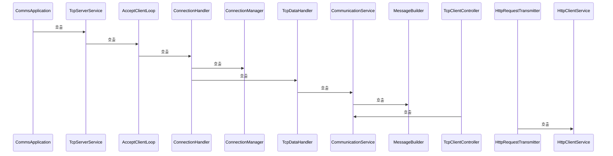
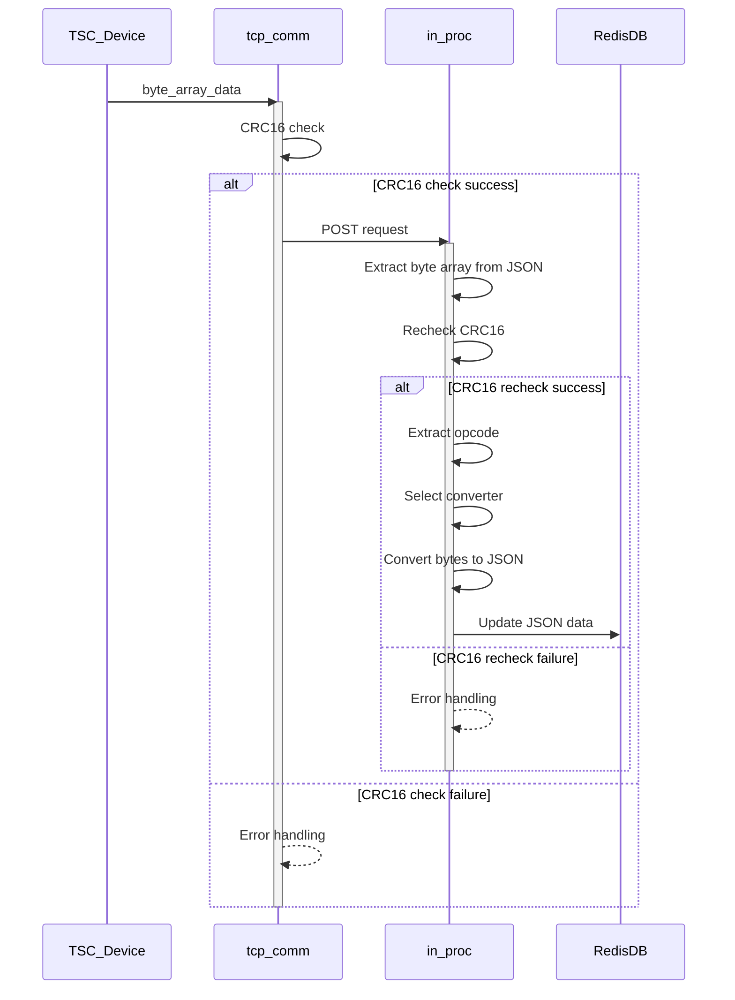

# TCP 통신 시스템 흐름 문서
## 1. 전체 아키텍처 개요


## 2. TCP 서버 시작 흐름
### 2.1 서버 초기화 단계
1. - Spring Boot 애플리케이션 시작점 **CommsApplication**
2. - TCP 서버 관리 서비스 **TcpServerService**
    - `@PostConstruct init()` 메서드에서 서버 자동 시작
    - 메서드 호출 `startServer()`
    - CommsProperties에서 포트 설정 로드

3. - 클라이언트 연결 수락 루프 **AcceptClientLoop**
    - 메서드에서 ServerSocket 생성 `startServer(port)`
    - 별도 스레드에서 메서드 실행 `run()`
    - 클라이언트 연결 대기 무한 루프 시작

## 3. 클라이언트 연결 처리 흐름
### 3.1 연결 수락 과정
```java
// AcceptClientLoop.run() 메서드 내부
while (running.get()) {
    Socket clientSocket = serverSocket.accept();
    String clientId = generateClientId(clientSocket);
    
    // ConnectionHandler에게 비동기 처리 위임
    tcpServerExecutor.submit(() -> 
        connectionHandler.handleNewConnection(clientId, clientSocket)
    );
}
```

### 3.2 연결 핸들링 과정
**ConnectionHandler.handleNewConnection()**:
1. 소켓 설정 (`configureSocket()`)
    - KeepAlive 활성화
    - 30초 읽기 타임아웃 설정
    - TCP_NODELAY 활성화
    - 버퍼 크기 설정 (8KB)

2. 연결 등록 (`ConnectionManager.addConnection()`)
3. 연결 성공 이벤트 발행 () `ConnectionEstablishedEvent`
4. 비동기 데이터 처리 시작 (`startAsyncDataProcessing()`)

## 4. 클라이언트 관리 시스템
### 4.1 ConnectionManager 역할
- **연결 저장소**: 사용 `ConcurrentHashMap<String, Connection>`
- **클라이언트 ID 관리**: IP:PORT 기반 고유 ID 생성
- **활성 상태 추적**: 마지막 활동 시간 기록
- **통계 정보 제공**: 연결 수, 바이트 통계 등

### 4.2 Connection 생명주기
```java
// 연결 추가
public void addConnection(String clientId, Socket socket) {
    Connection connection = new Connection(clientId, socket);
    connections.put(clientId, connection);
    totalConnectionCount.incrementAndGet();
}

// 활동 업데이트
public void updateActivity(String clientId) {
    Connection connection = connections.get(clientId);
    if (connection != null) {
        connection.updateLastActivity();
    }
}

// 연결 제거
public void removeConnection(String clientId) {
    Connection connection = connections.remove(clientId);
    if (connection != null) {
        connection.close();
    }
}
```

## 5. 데이터 송수신 관리
### 5.1 데이터 수신 흐름
**TcpDataHandler** (이벤트 기반):
1. 수신 `ConnectionEstablishedEvent`
2. 별도 스레드에서 `handleClientData()` 실행
3. InputStream에서 데이터 읽기 (1024바이트 버퍼)
4. 발행 `MessageReceivedEvent`
5. ConnectionManager 활동 시간 업데이트



(직접 처리): **ConnectionHandler**
1. `processClientData()` 메서드에서 바이너리 데이터 처리
2. 소켓 타임아웃 및 예외 처리
3. 연결 종료 시 정리 작업

### 5.2 데이터 송신 흐름
: **MessageSender**
```java
// 동기 전송
public void sendMessage(String clientId, byte[] data) {
    Socket socket = connectionManager.getSocket(clientId);
    OutputStream out = socket.getOutputStream();
    out.write(data);
    out.flush();
}

// 비동기 전송  
public CompletableFuture<Void> sendMessageAsync(String clientId, byte[] data) {
    return CompletableFuture.runAsync(() -> 
        doSendMessage(clientId, data), senderExecutor);
}
```

## 6. 메시지 처리 시스템
### 6.1 CommunicationService - 핵심 통신 서비스
- **단일 클라이언트 전송**: `sendMessage(clientId, opcode/data)`
- **브로드캐스트**: `broadcastMessage(opcode)` - 모든 활성 클라이언트
- **그룹 전송**: `sendMessageToGroup(clientIds, opcode)` - 특정 그룹
- **클라이언트 관리**: 요청 리스트 관리, 비활성 클라이언트 정리
- **통계 제공**: 전송 통계, 연결 통계

### 6.2 MessageBuilder 역할
- Opcode 기반 메시지 생성
- 지원되는 opcode 검증
- 메시지 포맷 표준화

## 7. HTTP 연동 시스템
### 7.1 웹 컨트롤러 레이어
- **TcpClientController**: TCP 클라이언트 관리 REST API
- **TcpDataController**: TCP 데이터 전송 REST API
- **HttpRequestTransmitter**: HTTP 요청 전달 컨트롤러
- **HealthCheckController**: 시스템 상태 체크

### 7.2 외부 HTTP 클라이언트
**HttpClientService**:
- 외부 시스템과의 HTTP 통신
- REST API 호출 관리
- 응답 처리 및 에러 핸들링

## 8. 이벤트 시스템
### 8.1 주요 이벤트들
- **ConnectionEstablishedEvent**: 새 연결 생성 시
- **ConnectionTerminatedEvent**: 연결 종료 시
- **MessageReceivedEvent**: 메시지 수신 시

### 8.2 이벤트 처리 흐름
```java
// 이벤트 발행
eventPublisher.publishEvent(new ConnectionEstablishedEvent(clientId, socket));

// 이벤트 수신
@EventListener
public void handleConnectionEstablished(ConnectionEstablishedEvent event) {
    // 처리 로직
}
```

## 9. 전체 데이터 흐름 요약
### 9.1 클라이언트 연결 시
```
클라이언트 연결 요청
    ↓
AcceptClientLoop (연결 수락)
    ↓
ConnectionHandler (연결 처리)
    ↓
ConnectionManager (연결 등록)
    ↓
TcpDataHandler (데이터 처리 시작)
    ↓
ConnectionEstablishedEvent 발행
```

### 9.2 메시지 송신 시
```
HTTP API 요청 (TcpDataController)
    ↓
CommunicationService (메시지 처리)
    ↓
MessageBuilder (메시지 생성)
    ↓
MessageSender (실제 전송)
    ↓
ConnectionManager (소켓 조회)
    ↓
Socket OutputStream (데이터 전송)
```

### 9.3 메시지 수신 시
```
Socket InputStream (데이터 수신)
    ↓
TcpDataHandler/ConnectionHandler (데이터 읽기)
    ↓
MessageReceivedEvent 발행
    ↓
ConnectionManager (활동 시간 업데이트)
    ↓
MessageTrackingService (전송 이력 기록)
```

## 10. 주요 설정 및 특성
- **스레드 풀**: TCP 서버 전용 Executor 사용
- **버퍼 크기**: 1024바이트 수신, 8KB 소켓 버퍼
- **타임아웃**: 30초 읽기 타임아웃
- **연결 관리**: Keep-Alive 활성화, TCP_NODELAY 사용
- **이벤트 기반**: Spring Event를 통한 비동기 처리
- **통계 수집**: 연결 수, 전송량, 활동 시간 등 추적
